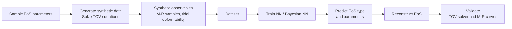

# Neutron Star Equation of State Inference

This project investigates the inverse stellar structure problem: inferring the equation of state (EoS) of neutron-star matter from observable quantities such as mass $M$, radius $R$, and tidal Love number $k_2$. We distinguish between a low-density outer region and a high-density inner region, which are treated as separate inference tasks.

We generate approximately 260,000 noisy synthetic observations by sampling candidate equations of state and solving the Tolman–Oppenheimer–Volkoff (TOV) equations. Neural networks are then used to reconstruct properties of the underlying EoS. The low-density EoS (AP4 or SLy) can be distinguished reliably through classification, while reconstruction of the high-density speed-of-sound profile is limited by degeneracy in the inverse mapping. Bayesian regression is additionally used to quantify uncertainties in the high-density reconstruction.

## Technical stack

| Area | Tools and methods |
| --- | --- |
| Programming | Python, NumPy, SciPy |
| Machine learning | PyTorch (classification and regression) |
| Uncertainty | Bayesian regression |
| Scientific computing | numerical TOV integration, interpolation, synthetic data generation |
| Data | ~260,000 noisy synthetic observations |
| Analysis | Feature importance, model validation |


## Pipeline overview

Neutron stars connect observable astrophysical quantities with the physics of matter at various density regions. Their internal structure is determined by the equation of state (EoS), which relates pressure $p$ and energy density $\varepsilon$. If the EoS is known, global properties such as the stellar mass $M$, radius $R$, and tidal love number $k_2$ can be obtained by solving the TOV equations.

The project reproduces and extends the deep-learning-based EoS inference framework introduced by Ventagli and Saltas. Parts of the pipeline are inspired by the [NS_CC_ML repository](https://github.com/GiuliaVentagli/NS_CC_ML), while the data-generation pipeline and other components are implemented independently.


*Figure 1. Overview of the simulation-based EoS inference pipeline. Sampled EoS parameters are used to generate synthetic neutron-star observables by solving the TOV equations. Neural models then infer EoS type and parameters, after which the reconstructed EoS is validated through the corresponding mass–radius curves.*

## Method

### Physical model

A neutron star is modelled as a static, spherically symmetric perfect-fluid configuration. Its internal structure follows from the Tolman–Oppenheimer–Volkoff (TOV) equations, which map an equation of state (EoS), $p(\varepsilon)$, to observable mass–radius relations and tidal Love numbers:

$$
\mathrm{EoS} \longrightarrow (M, R, k_2).
$$

The high-density EoS is parameterised through the squared speed of sound,

$$
c_s^2(\varepsilon) = \frac{dp}{d\varepsilon}, \qquad 0 \leq c_s^2 \leq 1,
$$

where the bound enforces causality. The inference task reverses this mapping: simulated noisy observables $(M, R, k_2)$ are used to infer the underlying EoS parameters and possible phase-transition behaviour.

**Data generation**

Candidate equations of state are sampled and used to generate neutron star models by numerically solving the TOV equations. From these solutions, observable quantities $(M,R,k_2)$ are sampled and Gaussian noise is injected to the data, representing measurement noise.

**Inference models**

Two inference tasks are considered. A classification network distinguishes between the AP4 and SLy models describing the low-density outer region. A regression network attempts to reconstruct the high-density EoS through its speed-of-sound parametrization. Bayesian regression is used to estimate uncertainty in the high-density reconstruction.

## Results

The classification model identifies the low-density EoS with approximately 91% test accuracy under the evaluation setup used in this repository. This is broadly consistent with the approximately 87% accuracy reported in the reference study. This is not intended as a controlled benchmark comparison, since the evaluation configurations are not identical.

For the high-density region, the regression results are comparable to the reference work. The model namely obtains a weaker signal. Rather than reconstructing the detailed speed-of-sound profile, its predictions tend toward a smoothed mean profile.

The weaker reconstruction results from the degeneracy of the inverse stellar structure problem. The mapping from the EoS to observables compresses the detailed internal structure of the star into a small number of global quantities. For example, the total stellar mass is given by

```math
M = 4\pi \int_0^R r^2 \varepsilon(r)\,dr.
```

Different internal energy-density profiles can produce approximately the same global observables. In particular,

```math
\varepsilon_1(r) \neq \varepsilon_2(r),
\qquad
\int_0^R r^2 \left[\varepsilon_1(r)-\varepsilon_2(r)\right]\,dr \approx 0.
```

This degeneracy makes the detailed high-density EOS difficult to recover from $(M,R,k_2)$ alone.

## Repository structure

- `data_generated/` — generated synthetic datasets produced by `generate_data.ipynb`.
- `data_reference/` — reference EoS tables required for data generation.
- `src/` — model implementations, plotting utilities and helper functions.
- `generate_data.ipynb` — synthetic-observation generation pipeline.
- `eos_inference_pipeline.ipynb` — model training and EoS-inference evaluation.
