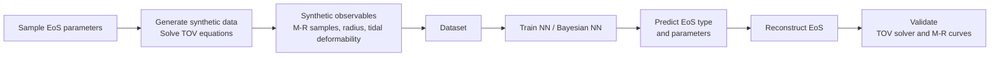

# Neutron Star Equation of State Inference

This project studies an inverse inference problem: recovering the underlying
equation-of-state parameters of neutron star matter from observable quantities
(mass, radius, tidal love number). This is useful because neutron-star cores reach matter densities that cannot be reproduced in terrestrial experiments, so constraining the EoS can provide insight into the behaviour of strongly interacting matter under extreme conditions.

Our simulation pipeline generates ~260k noisy synthetic observations by sampling
candidate equations of state and solving the Tolman–Oppenheimer–Volkoff (TOV)
equations. Machine learning models are trained to infer physical parameters
from noisy observations and to quantify predictive uncertainty.

## Technical stack

| Area                 | Tools and methods                                                        |
| -------------------- | ------------------------------------------------------------------------ |
| Programming          | Python, NumPy, SciPy                                                     |
| Deep learning        | PyTorch; neural networks for classification and regression               |
| Uncertainty          | Bayesian regression for predictive-uncertainty estimation                |
| Scientific computing | Numerical integration of the TOV equations; synthetic dataset generation |
| Simulation scale     | Approximately 260,000 noisy observation samples                          |
| Analysis             | Feature-importance analysis                                              |

## Pipeline overview

Neutron stars connect observable astrophysical quantities with the physics of matter at various density regions. Their internal structure is determined by the equation of state (EoS), which relates pressure $p$ and energy density $\varepsilon$. If the EoS is known, global properties such as the stellar mass $M$, radius $R$, and tidal love number $k_2$ can be obtained by solving the TOV equations.

The project reproduces and extends the deep-learning-based EoS inference framework introduced by Ventagli and Saltas. Parts of the pipeline are inspired by the [NS_CC_ML repository](https://github.com/GiuliaVentagli/NS_CC_ML), while the data-generation pipeline and other components are implemented independently.

*Figure 1. Overview of the simulation-based EoS inference pipeline. Sampled EoS parameters are used to generate synthetic neutron-star observables by solving the TOV equations. Neural models then infer EoS type and parameters, after which the reconstructed EoS is validated through the corresponding mass–radius curves.*

## Method

### Theoretical background

A neutron star is modelled as a static, spherically symmetric perfect-fluid configuration. Its internal structure follows from the Tolman–Oppenheimer–Volkoff (TOV) equations, which map an equation of state (EoS), $p(\varepsilon)$, to observable mass–radius relations and tidal Love numbers:

$$
\mathrm{EoS} \longrightarrow (M, R, k_2).
$$

The high-density EoS is parameterised through the squared speed of sound,

$$
c_s^2(\varepsilon) = \frac{dp}{d\varepsilon}, \qquad 0 \leq c_s^2 \leq 1,
$$

where the bound enforces causality. The inference task reverses this mapping: simulated noisy observables $(M, R, k_2)$ are used to infer the underlying EoS parameters and possible phase-transition behaviour.

**Data generation**

Candidate equations of state are sampled and used to generate neutron star models by numerically solving the TOV equations. From these solutions, observable quantities $(M,R,k_2)$ are sampled and Gaussian noise injections are added, representing measurement noise.

**Inference models**

Supervised neural networks are trained to infer properties of the neutron star equation of state from observable quantities $(M,R,k_2)$. Separate models identify properties of the low-density region and estimate parameters governing the higher-density regime. Feature-importance analysis is used to evaluate the contribution of each observable. Furthermore, a probabilistic model is implemented to estimate predictive uncertainties.

## Results

The classification model identifies the low-density EoS with approximately 92% test accuracy under the evaluation setup used in this repository. This is broadly consistent with, and numerically higher than, the approximately 87% accuracy reported for a related setup in the reference study. This is not intended as a controlled benchmark comparison, since the evaluation configurations are not identical.

For the high-density region, (Bayesian) regression results are comparable to the reference work. The regression model recovers large-scale trends in the speed-of-sound profile but smooths out oscillatory structure, indicating limited information content in $(M,R,k_2)$ observations.

This reflects a fundamental limitation of the problem: the mapping from the EoS to observables compresses a large amount of microscopic information into a small set of macroscopic parameters $(M,R,k_2)$, leading to degeneracies in the inverse reconstruction. In astrophysics, this phenomenon is known as the inverse stellar structure problem.

## Repository structure

## Repository structure

- `data_generated/` — generated synthetic datasets produced by `generate_data.ipynb`.
- `data_reference/` — reference EoS tables required for data generation.
- `src/` — model implementations, plotting utilities and helper functions.
- `generate_data.ipynb` — synthetic-observation generation pipeline.
- `eos_inference_pipeline.ipynb` — model training and EoS-inference evaluation.
